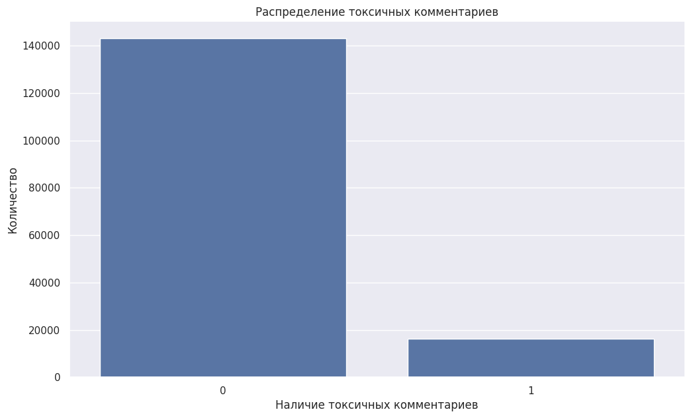

# Классификация токсичных комментариев

Сравнение классических NLP-моделей и BERT для автоматического направления токсичных пользовательских комментариев на модерацию.

## Executive summary

Исследование выполнено на размеченном наборе примерно из 160 тысяч англоязычных комментариев. Целевой класс несбалансирован в соотношении около 9:1. После очистки и лемматизации текста были сравнены модели на основе TF-IDF и предобученная BERT. Все обученные модели превысили требуемый уровень **F1 ≥ 0,75**, а лучший результат показала BERT — **F1 = 0,90** на тестовой выборке.

## Основные выводы

1. В исходных данных не обнаружены пропуски и явные дубликаты.
2. Токсичные комментарии составляют меньшинство: соотношение классов — примерно 1 к 9.
3. Логистическая регрессия достигла **F1 = 0,77**, пассивно-агрессивный классификатор — **F1 = 0,78**.
4. BERT показала лучший результат — **F1 = 0,90** на тестовой выборке.
5. Сравнение с Dummy-моделями подтвердило адекватность обученных решений.

## Стратегическая рекомендация

Для определения токсичных англоязычных комментариев использовать BERT как наиболее точную из проверенных моделей.

## Ограничения исследования

- Данные и итоговое решение ориентированы на комментарии на английском языке.
- Целевой признак существенно несбалансирован.

## Факты и гипотезы

README содержит только результаты, подтверждённые расчётами в ноутбуке. Дополнительные предположения о поведении пользователей или причинах токсичности не формулировались.

## Ключевой график

### Распределение целевого признака

## Сравнение моделей

| Модель | F1 |
|---|---:|
| Logistic Regression | 0,77 |
| Passive-Aggressive Classifier | 0,78 |
| BERT | **0,90** |

## Методология

1. Проверка качества и распределения классов.
2. Очистка текста, лемматизация и удаление стоп-слов.
3. TF-IDF-векторизация для линейных моделей.
4. Подбор гиперпараметров логистической регрессии и пассивно-агрессивного классификатора в пайплайне.
5. Применение предобученной BERT и подбор порога классификации.
6. Сравнение по F1 и проверка относительно Dummy-моделей.

## Файлы

- [`toxic-comment-classification.ipynb`](toxic-comment-classification.ipynb) — подготовка текста, обучение и оценка моделей.

## Технологии

`Python` · `pandas` · `scikit-learn` · `NLTK` · `TF-IDF` · `Transformers` · `BERT` · `Matplotlib` · `Seaborn`
